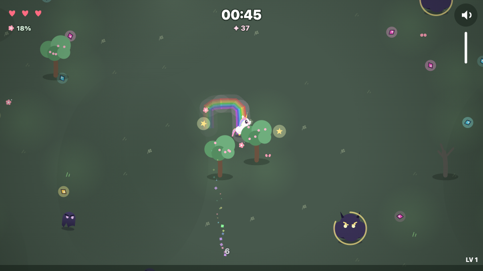

# AFTERGLOW 🦄🌈

[](https://github.com/Taehun/afterglow-js13k/actions/workflows/ci.yml)

**[▶ Play it now](https://taehun.github.io/afterglow-js13k/)** — the exact 13 kB submission build, auto-deployed from `main`.

> The storm swallowed the world's colors.
> Run, last unicorn — your afterglow brings them back.

A **unicorn survivors-like in 13 kB**, made for [js13kGames 2026](https://js13kgames.com/2026)
(theme: **Unicorns and Rainbows**).

Your rainbow trail *is* your weapon: shadows that touch the afterglow burn away,
standing still means zero firepower, and every field you cross blooms back to color.



## How to play

- **Move** — WASD / arrow keys, drag anywhere (touch), or gamepad stick / d-pad
- Your **afterglow trail** damages shadows that touch it — keep galloping, it's your only weapon
- Collect **shards** to level up and pick 1 of 3 upgrades (click / keys 1–3 / gamepad)
- Elites (gold crown) drop **luck items**: magnet, bomb, rainbow rush, star shower, heart
- Heal the meadow — bloom milestones (25 / 50 / 75 / 100 %) drop bonus items
- **M** or the speaker icon toggles mute, the vertical bar below it sets volume, **R** = quick restart

## Build

Requires **Node ≥ 22**. `zip` must be on PATH; `advzip`
([advancecomp](https://github.com/amadvance/advancecomp)) is optional but squeezes out extra bytes.

```sh
npm ci
npm run build       # → dist/game.zip — fails if it exceeds 13,312 bytes
npm run build:max   # submission build (Roadroller -O2, slow)
npm run dev         # dev server at http://localhost:1313 with live reload
```

More commands:

| command | what it does |
|---|---|
| `npm run size` | build + one-line size summary |
| `npm run smoke` | runs the built game in real Chromium/Firefox — asserts zero console errors |
| `npm run playtest` | automated end-to-end play session with assertions + screenshots |
| `npm run lint` | ESLint (flat config) over `src/` and `tools/` |
| `npm run typecheck` | JSDoc-based `tsc --strict` |
| `npm run check` | lint + typecheck + build + smoke |

## Under the 13 kB hood

- **Zero asset files** — everything is procedural: vector-canvas art, ZzFX sound effects,
  and a WebAudio sequencer playing a hypnotic 6/8 Celtic lilt
  (composed against an AI-generated reference track, ported into code via FFT analysis)
- **Fake-3D sky island** — y-sorted draw order, cliff face, waterfalls and parallax clouds below
- **One build, every device** — unified pointer/keyboard/gamepad input abstraction
  and a responsive logical viewport serve desktop and mobile from the same zip
- **Pipeline**: esbuild → terser (3-pass, property mangling) → Roadroller → inline HTML →
  `zip -9` → `advzip -4` (zopfli). The terser-only and Roadroller candidates are compared
  **by final zip size** — Roadroller's high-entropy output can lose to plain terser after deflate
- **Readable source** — `src/` stays commented and idiomatic; all compression lives in `tools/build.mjs`

## Repository layout

```
src/
├── engine/   reusable core — fixed-timestep loop, responsive canvas, input, sfx, save
├── game/     the game — player, mobs, loot, stats, fx, music, orchestration
├── vendor/   ZzFXMicro (MIT, modified for lazy AudioContext)
└── main.js   entry point
tools/        build pipeline, dev server, smoke test, automated playtest
docs/         design notes and research
```

## Credits

- [ZzFXMicro](https://github.com/KilledByAPixel/ZzFX) v1.3.2 by Frank Force (MIT)
- Built for [js13kGames](https://js13kgames.com) — thirteen kilobytes, no excuses
